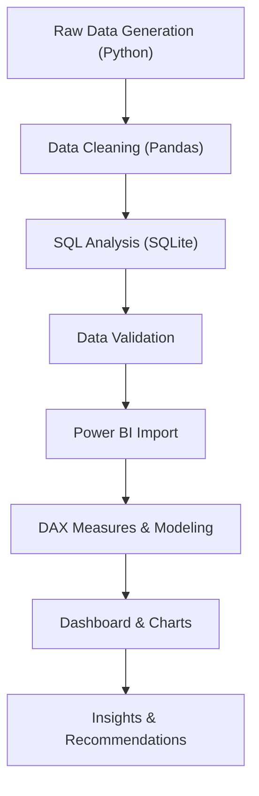

# boAt Sales Performance
# Analytical Report

**Power BI Dashboard Analysis of Revenue, Channel Mix, Product Category, Discount Behaviour and Customer Segments | 2024**

**Prepared By:**
Kaustuv

---

> boAt Lifestyle is an Indian consumer electronics brand specializing in stylish, affordable audio devices and wearable technology. It focuses on delivering innovative, youth-centric products that combine performance, design, and value to enhance everyday lifestyles.

---

## Executive Summary

This report consolidates the Power BI dashboard analysis built on the boAt sales dataset, covering revenue, order quantity, discounting, profitability, sales channel, product category and customer-segment dimensions. Total revenue across the year came in at approximately **₹21.84 Million** on **10,000 orders** with an average quantity of **1.74 units per order** (as summarised in the KPI cards). Total profit stood at **₹10.42 Million**, yielding a healthy overall profit margin of **47.7%**. Revenue performance diverged sharply by month, with festival months (October–November) significantly outperforming the April–June lean period. Online channels dominate the mix, with Amazon and Flipkart together accounting for more than **61%** of total revenue. On the product side, **Earbuds** is the clear volume leader with 3,001 orders — nearly double the next largest category (Neckbands at 2,210 orders).

| KPI | Value |
|-----|-------|
| **Total Revenue** | ₹21.84M |
| **Total Profit** | ₹10.42M |
| **Total Orders** | 10,000 |
| **Avg Rating** | 4.33 ⭐ |
| **Avg Sales (Qty)** | 1.74 |
| **Profit Margin** | 47.7% |

### Purpose of the Report

The purpose of this report is to demonstrate practical proficiency in **Python (Data Generation & Cleaning), SQL (Data Analysis)** and **Microsoft Power BI (Dashboard & Visualization)** by analyzing a simulated boAt sales dataset. The project showcases skills in data cleaning, transformation, DAX measures, interactive dashboard creation, and business insight generation, illustrating the ability to convert raw data into meaningful visualizations and actionable insights. This report has been prepared solely for learning, practice, and portfolio purposes.

---

## Data

### Dataset Description

The dataset used in this project is a synthetically generated dataset created for educational and analytical purposes. It simulates the operations of a retail and e-commerce business similar to boAt by incorporating realistic information related to customers, products, sales transactions, sales channels, and delivery operations. Although the data closely resembles real-world business scenarios, it does not contain any actual customer information or confidential company data.

| Attribute | Detail |
|-----------|--------|
| Total Records | 10,000 orders |
| Time Period | January – December 2024 |
| Products | 37 real boAt products |
| Categories | 6 (Earbuds, Headphones, Neckband, Smartwatch, Speaker, Wired Earphones) |
| States | 35 Indian states/UTs |
| Cities | 139 cities |
| Columns | 27 attributes |

### Data Cleaning

- ✅ Checked missing values — No null values found
- ✅ Checked duplicate records — 0 duplicate Order IDs
- ✅ Parsed Order_Date to proper datetime format (DD-MM-YYYY)
- ✅ Validated no negative revenues in dataset
- ✅ Ratings clipped to valid [1.0, 5.0] range
- ✅ Removed inconsistencies in data types

### Data Transformation

The raw dataset was generated using Python (`generate_boat_data.py`) with realistic weighted distributions for categories, sales channels, geography, and seasonality. The cleaning pipeline (`data_cleaning.py`) enriched the dataset with additional calculated columns including **Profit_Margin, Quarter, Quarter_Label, Day_of_Week,** and **Price_Segment** using Pandas transformations. The final cleaned CSV (`boat_sales_cleaned.csv`) was imported into Power BI, where **DAX measures** were created for KPI cards, formatted displays, and conditional aggregations.

---

## Methodology

The analysis followed a structured and systematic workflow, beginning with raw data generation and progressing through cleaning, SQL validation, and Power BI visualization to generate actionable business recommendations.

| Stage | Description |
|-------|-------------|
| **Raw Data** | Generated 10,000 realistic sales records using Python with weighted distributions |
| **Data Cleaning** | Missing values, date formats, data types corrected; calculated columns added |
| **Data Integration** | Profit Margin, Quarter, Price Segment, Day of Week derived from base columns |
| **Data Validation** | Cross-checked SQL query totals against Power BI DAX measures to confirm accuracy |
| **Dashboard** | Built interactive Power BI dashboard with 9 visual types, 3 slicers, and dark theme |
| **Insights** | Interpreted each visual to surface findings and business recommendations |

---

## Analysis

---

### Monthly Revenue Trend (2024)

Monthly revenue follows a clear seasonal pattern shaped by India's festival calendar and e-commerce sale events. The year begins with moderate revenue in January (₹1.53M) and February (₹1.54M), picks up in March (₹1.80M), then dips to its lowest point in April (₹1.38M) — marking the beginning of the lean quarter. May and June remain subdued at ₹1.49M and ₹1.45M respectively.

The mid-year recovery begins in July (₹1.70M), coinciding with Amazon Prime Day sales, and continues through August (₹1.71M) driven by Independence Day promotions. **September marks the inflection point** (₹2.11M) as pre-festival demand kicks in. The peak arrives in **October (₹2.50M)** and **November (₹2.62M)** — fuelled by Dussehra, Navratri, Diwali, and major e-commerce festivals (Flipkart Big Billion Days, Amazon Great Indian Festival). December eases to ₹2.00M as post-festival normalization sets in.

| Month | Orders | Revenue (₹) | Profit (₹) |
|-------|--------|-------------|------------|
| January | 692 | 1.53M | 0.76M |
| February | 671 | 1.54M | 0.77M |
| March | 769 | 1.80M | 0.90M |
| April | 611 | 1.38M | 0.69M |
| May | 603 | 1.49M | 0.74M |
| June | 635 | 1.45M | 0.72M |
| July | 783 | 1.70M | 0.79M |
| August | 793 | 1.71M | 0.78M |
| September | 896 | 2.11M | 1.06M |
| October | 1,269 | 2.50M | 1.08M |
| November | 1,351 | 2.62M | 1.14M |
| December | 927 | 2.00M | 1.00M |

> **Key Insight:** November is the peak revenue month at ₹2.62M, contributing **12.0%** of annual revenue. The Oct–Nov festive window alone generates **₹5.12M (23.4%)** of the full year's revenue.

---

### Revenue by State (Map Analysis)

State-wise sales are concentrated in western and southern India, with **Maharashtra** emerging as the strongest revenue contributor at **₹2.92M** (13.4% of total), followed by **Delhi at ₹2.28M** (10.4%) and **Karnataka at ₹2.03M** (9.3%). Tamil Nadu (₹1.94M) and Uttar Pradesh (₹1.55M) complete the top five. Southern states collectively exhibit the healthiest sales performance, while northern and eastern regions generate comparatively moderate revenues. The lighter shading across northeastern and island states indicates relatively lower sales, highlighting potential opportunities for market expansion and stronger distribution.

| Rank | State | Region | Orders | Revenue (₹) | Profit (₹) |
|------|-------|--------|--------|-------------|------------|
| 1 | Maharashtra | West | 1,357 | 2.92M | 1.40M |
| 2 | Delhi | North | 1,035 | 2.28M | 1.09M |
| 3 | Karnataka | South | 914 | 2.03M | 0.97M |
| 4 | Tamil Nadu | South | 888 | 1.94M | 0.92M |
| 5 | Uttar Pradesh | North | 728 | 1.55M | 0.74M |
| 6 | Gujarat | West | 647 | 1.46M | 0.69M |
| 7 | Telangana | South | 636 | 1.41M | 0.68M |
| 8 | Haryana | North | 507 | 1.15M | 0.55M |
| 9 | West Bengal | East | 454 | 0.98M | 0.46M |
| 10 | Rajasthan | North | 381 | 0.86M | 0.41M |

> **Key Insight:** The **Top 5 states alone contribute 49.0%** of total revenue, indicating high geographic concentration. The Northeast region (8 states, 310 orders, ₹0.62M) represents a significant untapped market.

---

### Sales Channel & Retail Platform Performance

Online channels are the company's primary revenue driver. **Amazon (₹7.33M)** and **Flipkart (₹6.10M)** are the two largest revenue contributors, together accounting for **61.5%** of total sales, highlighting the company's heavy reliance on leading e-commerce marketplaces. The **boAt Official Website** adds **₹4.89M (22.4%)**, reinforcing the importance of its direct-to-consumer (D2C) channel with potentially higher margins. **Reliance Digital** contributes **₹3.52M (16.1%)** as the offline retail partner, providing a stable secondary revenue stream and enhancing the company's overall market presence.

| Sales Channel | Orders | Revenue (₹) | Profit (₹) | Avg Rating | Share % |
|---------------|--------|-------------|------------|------------|---------|
| Amazon | 3,501 | 7.33M | 3.32M | 4.34 | 33.6% |
| Flipkart | 2,976 | 6.10M | 2.70M | 4.33 | 27.9% |
| boAt Website | 2,012 | 4.89M | 2.54M | 4.32 | 22.4% |
| Reliance Digital | 1,511 | 3.52M | 1.87M | 4.34 | 16.1% |

> **Key Insight:** While Amazon leads in revenue (₹7.33M), the **boAt Website delivers the highest profit per order (₹1,260)** compared to Amazon (₹947) — suggesting D2C channel expansion could significantly boost profitability.

---

### Product Category Performance

**Earbuds** is the runaway volume leader, generating **3,001 orders** — 30% of the total — and commanding the highest revenue at **₹6.74M**. Smartwatches rank second in revenue (₹4.59M) despite fewer orders (1,379), driven by higher average selling prices (₹1,908). Speakers contribute ₹3.96M from 1,116 orders with the highest category rating (4.43). **Neckbands** lead in unit volume (2,210 orders) but generate only ₹2.61M due to lower average prices (₹681). Wired Earphones are the smallest category with 804 orders and ₹0.51M revenue.

| Category | Orders | Revenue (₹) | Profit (₹) | Avg Rating | Avg Price (₹) |
|----------|--------|-------------|------------|------------|---------------|
| Earbuds | 3,001 | 6.74M | 3.23M | 4.40 | 1,266 |
| Smartwatch | 1,379 | 4.59M | 2.16M | 4.09 | 1,908 |
| Speaker | 1,116 | 3.96M | 1.87M | 4.43 | 2,050 |
| Headphones | 1,490 | 3.43M | 1.65M | 4.36 | 1,345 |
| Neckband | 2,210 | 2.61M | 1.25M | 4.37 | 681 |
| Wired Earphones | 804 | 0.51M | 0.25M | 4.24 | 367 |

> **Key Insight:** Earbuds should remain the primary focus for inventory planning, marketing spend and new SKU launches, while the **Smartwatch category** represents the strongest secondary growth lever with the highest average selling price.

---

### Top 5 Products by Sales Volume

The **boAt Airdopes 381** is the top seller with **397 orders**, followed closely by boAt Rockerz 255 Pro+ (396) and boAt Airdopes 190 (389). The top 5 products are all within a tight 12-unit range (385–397), indicating a healthy distribution of demand across the product lineup rather than dangerous dependence on a single SKU.

| Rank | Product | Orders | Revenue (₹) |
|------|---------|--------|-------------|
| 1 | boAt Airdopes 381 | 397 | 1.14M |
| 2 | boAt Rockerz 255 Pro+ | 396 | 0.51M |
| 3 | boAt Airdopes 190 | 389 | 0.78M |
| 4 | boAt Airdopes 161 | 386 | 0.77M |
| 5 | boAt Rockerz 238 | 385 | 0.38M |

> **Key Insight:** While Airdopes 381 and Rockerz 255 Pro+ have nearly identical order volumes, the **Airdopes 381 generates 2.2x more revenue** (₹1.14M vs ₹0.51M) due to its higher unit price — reinforcing that premium Earbuds models drive disproportionate value.

---

### Top 5 Cities by Sales Volume

Sales concentration is heavily skewed toward **Delhi**, which claims **3 of the top 5 city slots** — Karol Bagh (234), Saket (221), and Rohini (201). Thane (208) and Mumbai (204) from Maharashtra complete the list. This aligns with the state-level dominance of Delhi and Maharashtra in overall revenue.

| Rank | City | State | Orders | Revenue (₹) |
|------|------|-------|--------|-------------|
| 1 | Karol Bagh | Delhi | 234 | 0.47M |
| 2 | Saket | Delhi | 221 | 0.48M |
| 3 | Thane | Maharashtra | 208 | 0.45M |
| 4 | Mumbai | Maharashtra | 204 | 0.44M |
| 5 | Rohini | Delhi | 201 | 0.48M |

> **Key Insight:** Despite Karol Bagh having the highest order count, **Rohini and Saket deliver higher revenue per order** — indicating customers in these areas purchase higher-value products or larger quantities.

---

### Sales by Age Group

Out of 10,000 total orders, the **18–25 age group** forms the largest segment at **36.3%** (3,630 orders), followed by 26–35 at 25.5% (2,552 orders), 36–45 at 19.9% (1,991 orders), and 45+ at 18.3% (1,827 orders). The dominance of younger demographics — with the 18–35 bracket accounting for **61.8%** of all orders — is consistent with boAt's youth-centric brand positioning, heavy online/marketplace skew, and affordable price points.

| Age Group | Orders | Share % |
|-----------|--------|---------|
| 18–25 | 3,630 | 36.3% |
| 26–35 | 2,552 | 25.5% |
| 36–45 | 1,991 | 19.9% |
| 45+ | 1,827 | 18.3% |

> **Key Insight:** The **18–25 segment** is the brand's core audience. Marketing campaigns, influencer partnerships, and student-offer bundles should be heavily targeted at this cohort to maximize conversion.

---

### Payment Mode Distribution

**UPI** is the most preferred payment method at **29.7%** (2,974 orders), closely followed by **Card payments** at **27.6%** (2,757 orders). COD accounts for 22.0% (2,198 orders) and Net Banking for 20.7% (2,071 orders). The near-equal split across all four modes indicates a well-diversified payment ecosystem with no single-mode dependency risk.

| Payment Mode | Orders | Share % |
|--------------|--------|---------|
| UPI | 2,974 | 29.7% |
| Card | 2,757 | 27.6% |
| COD | 2,198 | 22.0% |
| Net Banking | 2,071 | 20.7% |

> **Key Insight:** UPI's leadership reflects India's digital payment revolution. The relatively high **COD share (22%)** presents an opportunity to incentivize prepaid orders with small discounts, reducing return/cancellation rates typical of COD orders.

---

### Gender Distribution

**Male customers** account for **62.0%** of all orders (6,196 orders, ₹13.57M revenue), while **female customers** contribute **38.0%** (3,804 orders, ₹8.27M revenue). The ~60:40 male-female split is typical for consumer electronics brands and suggests an opportunity to grow the female customer base through targeted marketing and product design.

| Gender | Orders | Share % | Revenue (₹) |
|--------|--------|---------|-------------|
| Male | 6,196 | 62.0% | 13.57M |
| Female | 3,804 | 38.0% | 8.27M |

---

### Discount Band Analysis

The discount analysis reveals a clear relationship between discounting levels and profitability. The **0–10% discount band** generates ₹6.02M from 2,303 orders with the highest average selling price (₹1,497), representing the most profitable segment. The **11–20% band** is the volume sweet spot, driving the highest revenue at ₹7.36M from 3,223 orders. As discounts increase beyond 30%, both average selling prices and total revenue decline sharply — the **40%+ band** generates only ₹0.90M from 564 orders.

| Discount Range | Orders | Avg Selling Price (₹) | Revenue (₹) | Avg Rating |
|----------------|--------|----------------------|-------------|------------|
| 0–10% | 2,303 | 1,497 | 6.02M | 4.34 |
| 11–20% | 3,223 | 1,327 | 7.36M | 4.33 |
| 21–30% | 2,375 | 1,150 | 4.86M | 4.34 |
| 31–40% | 1,535 | 1,020 | 2.70M | 4.32 |
| 40%+ | 564 | 886 | 0.90M | 4.34 |

> **Key Insight:** The **11–20% discount band is the optimal sweet spot**, balancing maximum order volume with strong revenue generation. Discounts beyond 30% erode margins significantly without proportional volume gains. **Customer ratings remain consistent (4.32–4.34) regardless of discount level**, proving that discounts do not improve customer satisfaction.

---

### Region-Wise Performance

**North India** is the largest revenue contributor at **₹7.72M** from 3,536 orders across 11 states and 52 cities. The **South** follows closely at ₹6.59M (2,993 orders), while **West India** generates ₹4.63M from just 3 states. The **East, Northeast, Central, and Island** regions collectively contribute only ₹2.90M — representing significant growth headroom.

| Region | States | Cities | Orders | Revenue (₹) | Profit (₹) |
|--------|--------|--------|--------|-------------|------------|
| North | 11 | 52 | 3,536 | 7.72M | 3.69M |
| South | 6 | 27 | 2,993 | 6.59M | 3.15M |
| West | 3 | 16 | 2,125 | 4.63M | 2.21M |
| East | 4 | 20 | 927 | 2.05M | 0.97M |
| Northeast | 8 | 19 | 310 | 0.62M | 0.30M |
| Central | 1 | 4 | 74 | 0.15M | 0.07M |
| Islands | 2 | 2 | 35 | 0.08M | 0.03M |

> **Key Insight:** The **Northeast has 8 states but generates only ₹0.62M** — less than a single top city like Karol Bagh. This region presents the biggest untapped opportunity for distribution expansion and brand awareness campaigns.

---

## Key Insights & Recommendations

### 1. Cap Discounting at 30%
The 11–20% discount band is the profit-volume sweet spot, generating ₹7.36M at maximum order volume. Beyond 30%, margins erode rapidly without proportional volume gains. Restrict deep discounts to end-of-season inventory clearance only.

### 2. Double Down on Earbuds
Earbuds drive 30% of orders and command the highest revenue (₹6.74M) with a strong 4.40 rating. Prioritize this category for inventory planning, marketing spend, and new SKU launches, with Smartwatches as the strongest secondary growth lever.

### 3. Expand the D2C Channel (boAt Website)
While the boAt Website has fewer orders than Amazon/Flipkart, it delivers the **highest profit per order (₹1,260 vs ₹947 on Amazon)**. Investing in the website's user experience, exclusive product launches, and loyalty programs can significantly boost margins.

### 4. Strengthen the Amazon–Flipkart Partnership
Amazon and Flipkart together deliver 61.5% of revenue. Continue investing in sponsored ads, deal-of-the-day placements, and festival-season promotions on these platforms to maintain market share.

### 5. Capitalize on the Oct–Nov Festival Window
The October–November festive period generates **₹5.12M (23.4% of annual revenue)** in just 2 months. Plan inventory build-up, marketing campaigns, and exclusive product launches around Dussehra, Diwali, and e-commerce sale events.

### 6. Target the 18–25 Segment Aggressively
This cohort drives 36.3% of all orders. Deploy influencer marketing, campus ambassador programs, student discounts, and social media campaigns tailored to Gen Z preferences to maintain and grow this base.

### 7. Expand into Underserved Regions
The Northeast (8 states, ₹0.62M), Central (₹0.15M), and Islands (₹0.08M) collectively represent massive untapped potential. Partner with local retailers, strengthen logistics infrastructure, and run region-specific awareness campaigns.

### 8. Incentivize Prepaid Payments over COD
COD orders (22% share) typically carry higher return and cancellation rates. Offer small prepaid discounts (₹50–100 off) or exclusive offers for UPI/Card payments to shift the mix toward digital payments.

---

## Dashboard Preview

The interactive Power BI dashboard features:
- **5 KPI Cards** — Total Revenue, Profit, Orders, Avg Rating, Avg Sales
- **3 Interactive Slicers** — State, Sales Channel, Category
- **State-Wise Performance Map** — Filled Map with red gradient (dark theme)
- **Sales by Age Group** — Donut chart (4 segments)
- **Payment Modes** — Donut chart (4 modes)
- **Revenue by Sales Channels** — Clustered column chart
- **Revenue Trend by Month** — Area/Line chart (Jan → Dec, sorted chronologically)
- **Top 5 Products by Sales** — Horizontal bar chart (TopN filter)
- **Top 5 Cities by Sales** — Horizontal bar chart (TopN filter)

**Design:** Dark navy theme (#0B1120) with card backgrounds (#131B2E), boAt red accent (#FF0000), white typography, and glassmorphic card borders.

---

> **Tools Used:** Python (Data Generation & Cleaning) | SQL / SQLite (Data Analysis) | Microsoft Power BI (Dashboard & DAX) | Pandas, CSV, Random libraries

---

*Generated for boAt Sales Analytics Dashboard Project*
*Dataset: 10,000 orders | 37 products | 6 categories | 35 states | 139 cities | Year 2024*
